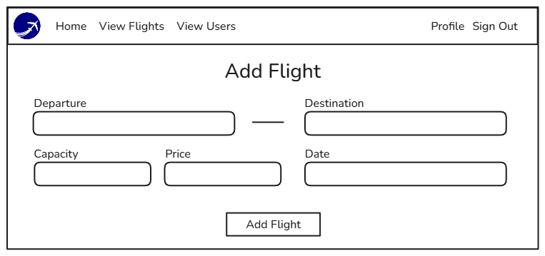
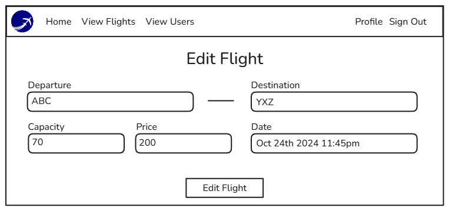
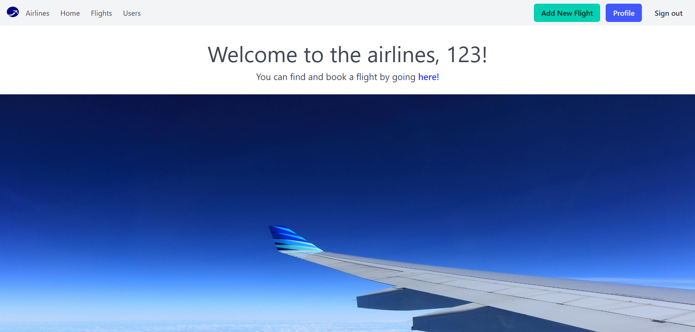

# Airlines Management
## Introduction

A full-stack website with user authentication and authorization for managing and booking flights. The main features of this website is to add, view, edit and delete flights as an admin user. Then the normal user will be able to view currently added flights and their details and book for them.

## ERD Diagram


## Mockups
### Landing Page

### View Flights List Page

### View Flight Information Page

### Users Dashboard Page

### Add Flight Page

### Edit Flight Page



## Data Models
### The ```User``` schema

| Property | Type     | Required | Description          |
|----------|----------|----------|----------------------|
| username | String | true | The username for the account used for logging in.|
| password | String | true | The password for the account used for logging in.|
| isAdmin | Boolean | true | Determines the privileges for this account.|

### The ```Flight``` schema

| Property | Type     | Required | Description          |
|----------|----------|----------|----------------------|
| departure |String | true | The airport airplane is departing from.|
| destination |String | true | Name of the airport where the airplane is landing.|
| capacity | Number | true | The maximum number of seats for this flight.|
| date | Date | true | The date and time of the departure of the airplane.|
| price | Number | true | The price of the tickets per seat for this flight.|
| owner | ObjectId | true | The reference id for the admin who created this flight.|
| bookedByUsers | [ ObjectId ] | false | A list of reference for users who booked this flight.|

## User Stories
- As a User (AAU), I should be able to sign up for an account and/or sign in with an account before I can view and book for flights.
- AAU, I want to be able to see all current flights and book for a flight, Which should clearly show me that I have successfully booked for this flight.
- AAU, I should be able to view a list of all the flights I have booked for and be able to click on a flight to view its related information.
- AAU, I need to be able to cancel my flight, which should remove it from my flights list and make me eligible to book for that same flight again if I want to.
- As an Admin (AAA), I need to be able to view a dashboard of all users which show their username and their current role.
- AAA, I should be able to create, view, edit and delete flights that I have created, as well as view flights created by other users.
- AAA, I need to be able to view a list of flights created by a specific admin user. This can be done by clicking on their name from either the users dashboard if they're an admin user or from the flights list.

## Pseudo code
### 1. Add links to new routes in the landing page

### 2. Adjust users module and add isAdmin property

### 3. Create flights module

### 4. Create the controllers and views
- Create flight routes
    - flights index - GET
    - flights add page - GET
    - flights add - POST
    - flgihts show page - GET
    - flgihts edit page - GET
    - flgihts update - PUT
    - flgihts delete - DELETE

- Create user routes
	- user index - GET
	- user show page - GET
	- user edit page - GET
	- user update - PUT
	- user delete - DELETE

- Build Index functionality
	- retrieve list of all items from database
	- create index page and pass list of items to it
	- display resource on index page

- Build Add functionality
	- create add page
	- send request to database on post request
	- send user to resource index

- Build Show functionality
	- create show page

	- get id of resource and retrieve information from database and send it to show page
	- display data on show page
	- send user to resource index

- Build Edit functionality
	- create edit page (similar to add page)
	- get id of resource and retrieve information from database and send it to edit page
	- set value of fields to the form from passed in data
	- override form with PUT request to update information of the resource
	- send user to resource index

- Build Delete functionality
	- get id of item and retrieve resource passed into a variable
	- send delete request to the database to delete resource
	- send user to resource index

### 5. Error-handling
- respond with an error page when any CURD function fails

### 6. Style application
Add Styling for
- Nabvar
- Landing page
- Flight Index, Add, Edit, Delete
- User Index, Edit

## Routes
### User routes
| Action | Route                                   | HTTP Verb |
|--------|-----------------------------------------|-----------|
| Index  | `/users`                              | GET       |
| Show   | `/users/:userId`                    | GET       |
| Edit   | `/users/:userId/edit`               | GET       |
| Update | `/users/:userId`                    | PUT       |
| Delete | `/users/:userId`                    | DELETE    |

### Flight routes
| Action | Route                                   | HTTP Verb |
|--------|-----------------------------------------|-----------|
| Index  | `/flights`                              | GET       |
| New    | `/flights/new`                          | GET       |
| Create | `/flights`                              | POST      |
| Show   | `/flights/:flightId`                    | GET       |
| Edit   | `/flights/:flightId/edit`               | GET       |
| Update | `/flights/:flightId`                    | PUT       |
| Delete | `/flights/:flightId`                    | DELETE    |

## 🚀 Live Demo 
You can test a live demo of the webapp [here!](https://airlines-management-dbcdb1428ca1.herokuapp.com/)

## Technologies
 - HTML
 - CSS
 - Bulma (CSS Framework)
 - Javascript
 - MongoDB
 - Express
 - Node
 - EJS (Embedded Javascript)
 - Mongoose
 - API

 ## Attributions 
 - [API Ninjas Airports](https://api-ninjas.com/api/airports)
 - [Bulma (CSS Framework)](https://bulma.io/)

## Screenshots
### Home Page

### Sign Up Page

### Login Page

### Admin Landing Page

### User Landing Page

### Flights Page

### Show Page

### Edit Page

### Profile Page

### Users Page


## Future Work
- Search and filter flights 
- Add mobile phone support
- Validations (e.g. hide flights past date)